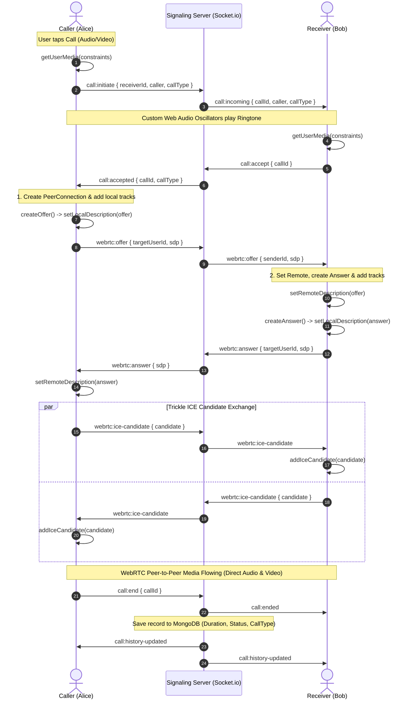

# WebRTC Audio & Video Calling Architecture: Interview Masterclass Guide

This document is a comprehensive, deep-dive technical reference designed to prepare you for senior-level engineering interviews. It details the complete architecture, protocols, lifecycle, and edge-case handling of the 1-to-1 Audio & Video Calling feature implemented in this application.

---

## 1. High-Level Architecture Overview

A real-time WebRTC calling system consists of two distinct layers:
1. **Signaling Plane (WebSocket / Socket.io)**: Transports session metadata, call state, and connection details between clients before the direct connection is established.
2. **Media Plane (WebRTC / Peer-to-Peer)**: Transports encrypted, low-latency audio and video streams directly between the two browser clients (peer-to-peer).

```
   ┌──────────┐                               ┌──────────┐
   │ Client A │                               │ Client B │
   └────┬─────┘                               └─────┬────┘
        │                                           │
        │ 1. Signaling (Offer, Answer, ICE, State) │
        │◄───────────────────►┌────────────────────►│
        │                     │  Node.js + Socket  │
        │                     └────────────────────┘
        │
        │ 2. Direct Media Stream (SRTP / P2P Audio & Video)
        │◄═════════════════════════════════════════►│
```

### Why Can't WebRTC Work Without a Signaling Server?
WebRTC peers cannot discover each other automatically because:
- Most consumer devices reside behind **NATs (Network Address Translation)** or private firewalls and do not have public IP addresses.
- Devices must agree on codecs, resolutions, encryption keys, and network routes beforehand.
- The Socket.io server acts as the **rendezvous point** to exchange this initialization data. Once established, media flows directly peer-to-peer, bypassing our backend server.

---

## 2. Core Concepts: SDP, STUN, and ICE

### A. SDP (Session Description Protocol)
SDP is a text-based format describing multimedia communication parameters:
- Supported codecs (Opus for audio, VP8/VP9/H.264 for video).
- Media types, bandwidth limits, transport protocols (RTP/SRTP).
- Encryption parameters (DTLS / SRTP fingerprints).
- Timing and session identifiers.

### B. STUN (Session Traversal Utilities for NAT)
- When a device is on Wi-Fi or mobile data, it has a private IP (e.g., `192.168.1.5`).
- The device contacts a public **STUN server** (e.g., `stun:stun.l.google.com:19302`).
- The STUN server replies: *"To the public internet, your external IP is `123.45.67.89` and your port is `54321`"*.
- This discovered IP:port pair is called a **Server Reflexive Candidate (srflx)**.

### C. ICE (Interactive Connectivity Establishment) & Trickle ICE
- **ICE** is the framework that gathers all possible connection routes (candidates):
  1. **Host candidates**: Local private IP (direct Wi-Fi/LAN connection).
  2. **Server reflexive (srflx) candidates**: Public IP obtained from STUN.
  3. **Relay candidates**: Relayed address via a TURN server (fallback when symmetric NAT blocks direct P2P).
- **Trickle ICE**: Instead of waiting to discover *all* candidates before sending the SDP, candidates are sent asynchronously one by one as they are found via Socket.io (`webrtc:ice-candidate`), drastically reducing call setup latency.

---

## 3. End-to-End Call Lifecycle (Signaling Flow)



---

## 4. Key Engineering Challenges & Solutions

### 1. Handling Asynchronous ICE Candidate Race Conditions
* **The Problem**: In Trickle ICE, network candidate packets can reach the receiver *before* the remote SDP offer has been parsed and applied by `setRemoteDescription()`. Calling `pc.addIceCandidate()` before `setRemoteDescription()` causes a fatal WebRTC exception: `InvalidStateError: Remote description not set`.
* **The Solution**: An in-memory candidate queue (`iceCandidatesQueue`):
  ```javascript
  socket.on("webrtc:ice-candidate", async ({ candidate }) => {
      if (peerConnection && peerConnection.remoteDescription) {
          await peerConnection.addIceCandidate(new RTCIceCandidate(candidate));
      } else {
          iceCandidatesQueue.push(candidate); // Queue until description is ready
      }
  });

  // After setRemoteDescription succeeds:
  while (iceCandidatesQueue.length > 0) {
      const candidate = iceCandidatesQueue.shift();
      await pc.addIceCandidate(new RTCIceCandidate(candidate));
  }
  ```

### 2. Synthesizing Zero-Asset Ringtones via Web Audio API
* **The Problem**: Relying on external `.mp3` files for incoming and outgoing ringtones introduces network latency, CDN 404s, mobile asset caching bugs, and autoplay restrictions.
* **The Solution**: Synthesizing telephone supervisory ringtones entirely in code using browser native `AudioContext` and `OscillatorNode`:
  - **Outgoing US Ringback Tone**: Dual sine wave frequencies (440 Hz + 480 Hz) pulsing on a 2s on / 4s off cadence.
  - **Incoming Ringing Tone**: Dual frequencies (480 Hz + 800 Hz) pulsed with rhythmic gain modulation.
  - Stopped instantly via `.stop()` and audio context teardown upon call answer or rejection.

### 3. Mobile Proximity Sensor Blackout (Earpiece Mode)
* **The Problem**: When holding a phone to the ear in earpiece mode during an audio call, cheek touches can accidentally trigger screen buttons (mute, end call, navigation).
* **The Solution**:
  - Implemented multi-tiered proximity detection:
    1. Modern W3C `ProximitySensor` API (`reading` event).
    2. Legacy `userproximity` and `deviceproximity` window events.
    3. Fallback `AmbientLightSensor` (lux < 2 when blocked by the ear).
  - Renders a pitch-black, touch-blocking overlay (`#000000`, `touchAction: none`) only when `callStatus === "connected" && !isSpeakerOn && callType === "audio"`.
  - Automatically bypassed during video calls or speakerphone mode.

### 4. Audio Routing: Internal Earpiece vs Loudspeaker
* **The Problem**: Mobile web browsers default audio output to the loud speakerphone rather than the internal earpiece speaker, compromising call privacy.
* **The Solution**:
  - Used `HTMLMediaElement.setSinkId(deviceId)` combined with `navigator.mediaDevices.enumerateDevices()` to inspect `audiooutput` devices.
  - Dynamically routes audio to the internal receiver/earpiece on mobile, with volume attenuation (0.25 vs 1.0) to ensure a safe, natural listening volume near the ear.

### 5. Seamless Front / Back Camera Switching Without Renegotiation
* **The Problem**: Switching between selfie and environment cameras during a video call often causes renegotiation flashes or connection drops.
* **The Solution**:
  - Used `RTCRtpSender.replaceTrack()`:
  ```javascript
  const newStream = await navigator.mediaDevices.getUserMedia({
      video: { facingMode: newFacingMode }
  });
  const newVideoTrack = newStream.getVideoTracks()[0];
  const sender = peerConnection.getSenders().find(s => s.track?.kind === "video");
  await sender.replaceTrack(newVideoTrack); // Seamlessly swaps video feed without SDP renegotiation!
  oldTrack.stop();
  ```

### 6. Clean State Teardown & Resource Leak Prevention
* **The Problem**: Leaving media tracks running keeps device cameras/microphones active (causing battery drain and privacy indicators staying on). Unclosed peer connections leak file descriptors and memory.
* **The Solution**:
  - Centralized `resetCallState()` method:
    - Iterates over all tracks in `localStream` and calls `track.stop()`.
    - Closes `RTCPeerConnection` and dereferences it.
    - Clears duration interval timers and resets UI store states.
    - Handled symmetrically on manual hangup, peer disconnect, and socket dropouts.

---

## 5. System State Store Design (Zustand)

The calling feature is managed through a central `useCallStore`:
* **State Variables**:
  - `callStatus`: `"idle"` | `"outgoing"` | `"incoming"` | `"connected"`
  - `callType`: `"audio"` | `"video"`
  - `callWith`: User document of the other party.
  - `localStream` / `remoteStream`: `MediaStream` objects.
  - `isMuted` / `isVideoOff`: Boolean states for local track enablement.
  - `isSpeakerOn`: Boolean controlling speaker vs earpiece output.
  - `callDuration`: Elapsed seconds counter.
  - `callHistory`: Chronological array of past calls populated from `/api/calls/history`.

---

## 6. Interview Questions & Model Answers

### Q1: "Why did you use WebSockets for signaling instead of HTTP REST polling?"
> **Answer**: *"WebRTC signaling is inherently bidirectional and event-driven. Calls, accepts, rejects, and ICE candidate generation happen asynchronously within milliseconds. HTTP polling would introduce severe latency (a caller might wait seconds to know their call was answered) and excessive server load. WebSockets provide a persistent, full-duplex TCP channel with minimal overhead, allowing real-time relay of offers, answers, and Trickle ICE candidates with sub-50ms latency."*

### Q2: "What happens if two users are behind symmetric NATs?"
> **Answer**: *"If both peers are behind Symmetric NATs (common on enterprise firewalls or 4G/5G mobile carriers), STUN cannot establish direct peer-to-peer connectivity because each outgoing connection gets assigned a different random external port. In that scenario, STUN fails to find a valid ICE candidate pair. To guarantee connection success in 100% of network topologies, we deploy a **TURN server** (Traversal Using Relays around NAT), which acts as an authorized relay proxy for encrypted media."*

### Q3: "What is the difference between stopping a track vs muting a track in WebRTC?"
> **Answer**:
> - *"**Muting (`track.enabled = false`)**: The media track remains active within the `RTCPeerConnection` and SDP negotiation is untouched, but the browser outputs black frames (for video) or silence packets (for audio). Unmuting (`track.enabled = true`) restores the feed instantly with zero renegotiation."*
> - *"**Stopping (`track.stop()`)**: Releases hardware resources (the camera LED turns off and microphone hardware disconnects). Once stopped, a track cannot be restarted; a new `getUserMedia()` call and `replaceTrack()` or full SDP renegotiation is required."*

### Q4: "How did you optimize the chat list to only show active conversations?"
> **Answer**: *"Rather than listing all registered users in the database, our `/api/message/users` endpoint performs an optimized MongoDB query finding messages where `req.user._id` is either `senderId` or `receiverId`. We extract distinct user IDs, attach their latest message preview and timestamp, sort them chronologically, and populate their profile data. Users can discover and start new conversations with any platform member via the dedicated Search/Add tab."*

### Q5: "How does the Call History stay synchronized in real time across devices?"
> **Answer**: *"When a call ends, fails, or is rejected, the backend socket server writes a populated `Call` document to MongoDB with the duration and status. It immediately emits a `call:history-updated` event targeting the specific socket IDs of both the caller and receiver. The frontend `useCallStore` receives this record and prepends it to the active state array without requiring any page reload."*
